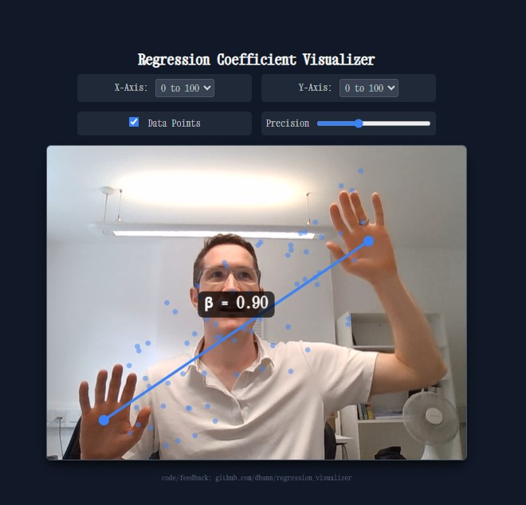

# Interactive Regression Visualizer

Use your hands to visually explore the concept of a regression coefficient (β) + precision in real-time. A demo of an 'intuition-first' approach to learn statistics. Built with AI (gemini 2.5).

**[try it!](https://dbann.github.io/regression_visualizer/)**

## Features

- **Live Hand Tracking:** Uses your hands to control the slope of a regression line.
- **Real-time Coefficient Calculation:** See the `β` value change instantly as you move your hands.
- **Interactive Data:** Visualize a scatter plot of data points that adjusts to the line.
- **Variable Scaling:** Change the scale of the X and Y axes (`0-10`, `0-100`, etc.) to see how it impacts the coefficient.
- **Precision Control:** Adjust a slider to see how the tightness (precision) of the data affects your model.

## How to Use

1.  **Open the link** to the application.
2.  **Allow camera access** when prompted by your browser.
3.  **Clap and show both hands** to the camera to begin.
4.  Move your hands to change the slope and use the on-screen controls to explore!

## Development

This application was created with the help of Google's Gemini Pro. The core functionality is built with standard HTML, JavaScript, and CSS, using the [MediaPipe Hands](https://developers.google.com/mediapipe/solutions/vision/hand_landmarker) library for hand tracking. Inspired by [this]
(https://x.com/googleaidevs/status/1936193938639012065) X thread 21st June 2025. 

## Related Projects

- [Eyeball the Regression Line](https://sophieehill.shinyapps.io/eyeball-regression/)  
  A Shiny app by [Sophie Hill](https://github.com/sophieehill) where users try to draw the best-fit regression line through scatterplots.  
  Repo: [github.com/sophieehill/eyeball-regression](https://github.com/sophieehill/eyeball-regression)

- [Guess the Correlation](https://guessthecorrelation.com)  
  A simple browser game by @omarwagih that challenges users to estimate the correlation coefficient by eye.

## Feedback

Feedback, questions, and suggestions are welcome. Please contact [david.bann@ucl.ac.uk](mailto:david.bann@ucl.ac.uk). 

## License

This project is open source and available under the [MIT License](https://opensource.org/licenses/MIT).
